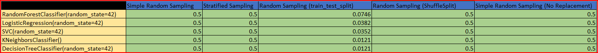

# Credit Card - Sampling and Model Evaluation
## Introduction
This project aims to perform credit card fraud detection using different sampling techniques and machine learning models. 

## Dataset Overview
The dataset contains credit card transactions with features such as time, amount, and anonymized numerical features (V1, V2, ..., V28). The target variable is "Class," indicating whether a transaction is fraudulent (1) or not (0).

# Approach
## Data Loading and Exploration:
Explore the dataset to understand its structure and characteristics.

## Class Balancing:
Analyze the class distribution and check for class imbalance.
Apply techniques to balance the classes, such as oversampling, undersampling, or a combination of both.

## Sample Creation:
Use the sample size detection formula to create five different samples.

## Sampling Techniques:
Apply five different sampling techniques on the balanced dataset:
- Simple Random Sampling
- Stratified Sampling
- Random Sampling (train_test_split)
- Random Sampling (ShuffleSplit)
- Simple Random Sampling (No Replacement)

## Machine Learning Models:
Train five different machine learning models (M1 to M5) on each sample.
- Model M1: RandomForestClassifier
- Model M2: LogisticRegression
- Model M3: Support Vector Machine (SVM)
- Model M4: K-Nearest Neighbors (KNN)
- Model M5: Decision Tree Classifier

## Model Evaluation:
Evaluate the performance of each model on different samples.
Determine which sampling technique yields higher accuracy for each model.

## Results

